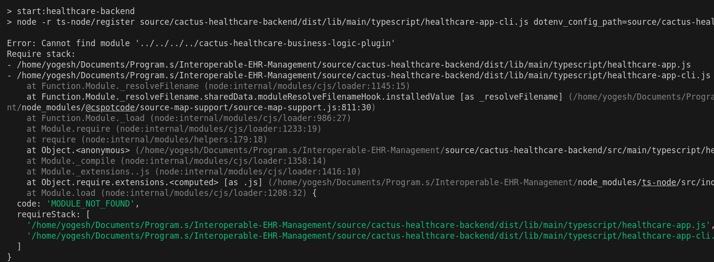

## Getting Started

### Prerequisites
- Docker installed with appropriate sudo permissions.

- **Install Fabric Binaries**  
Run this command to install necessary Fabric binaries:
```bash
./install-fabric.sh binary
```


script to start net-2(root)

```bash
./create-network.sh
```


## Starting the application
#### build the project(root)

```bash
npm run configure
```

#### Running the cacti node(root)
```bash
npm run start:healthcare-backend
```
### Couchdb

http://localhost:5984/_utils/
COUCHDB_USER=admin
COUCHDB_PASSWORD=adminpw

### Intrachain - Backend
Navigate to the backend directory and run the following command to start the backend for intrachain operations:

```bash
cd backend
npm start
```

### tape test

```bash
./tape-Linux-X64 commitOnly --config=config.yaml --number=1000
```

### openAPI schema 

```bash
cd source/cactus-healthcare-business-logic-plugin
```

```bash 
npm run generate-sdk:typescript-axios
```


## npm package error (yet to be deployed)



```bash 
cd source/cactus-healthcare-backend/dist/lib/main/typescript
```

#### Change the path from (once and only after you build (ts->js))

```bash
const cactus_healthcare_business_logic_plugin_1 = require("../../../../cactus-healthcare-business-logic-plugin"); 
```

to 

```bash 
cactus_healthcare_business_logic_plugin_1 = require("../../../../../cactus-healthcare-business-logic-plugin");
```

### After Setup

Remove the volume of the fabric-all-one container (remove the container)